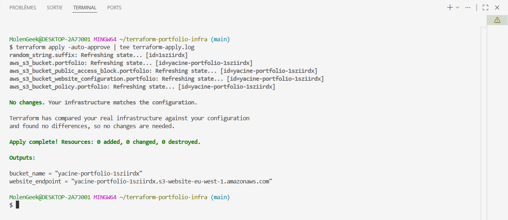
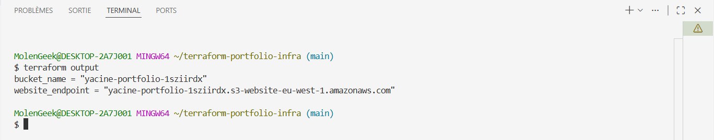
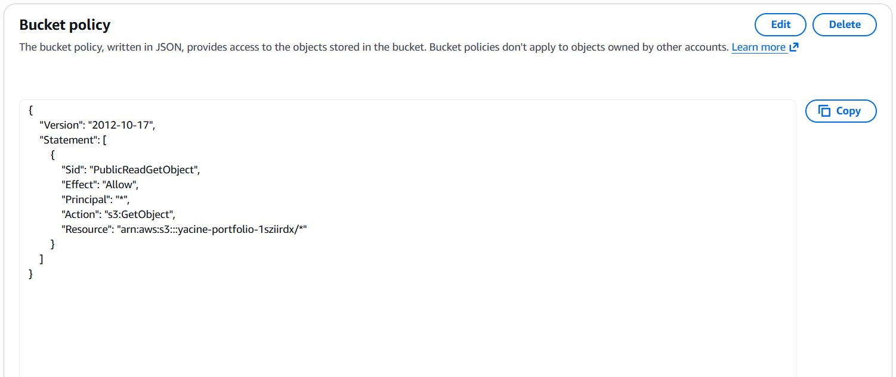
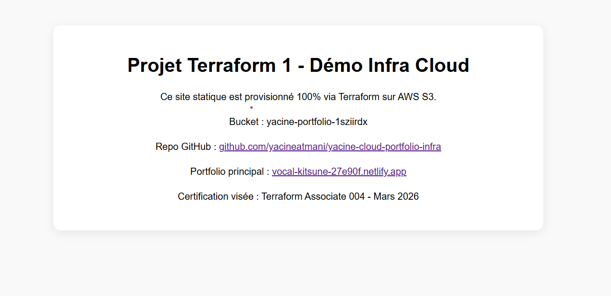
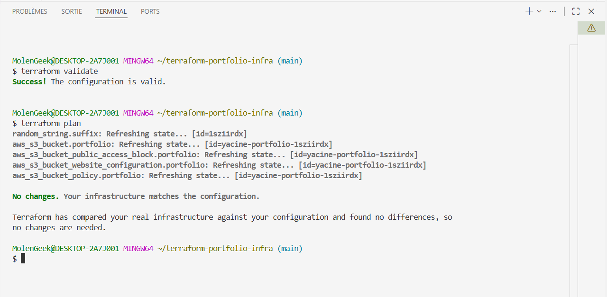

# Projet 1 : Provisionnement IaC de mon portfolio statique sur AWS S3

**Objectif** : démontrer les bases de Terraform pour provisionner une infrastructure AWS simple et publique (S3 static website).

## Features appliquées
- Provider AWS (`eu-west-1`)
- Remote state possible (à implémenter ensuite)
- `random_string` pour un nom de bucket unique
- Lifecycle `prevent_destroy` (concept clé Terraform Associate 004)
- Bucket policy publique pour lecture `GetObject`
- Static website hosting activé (`index.html` / `error.html`)
- Outputs Terraform : bucket name + website endpoint

## Étapes réalisées
1. `terraform init`
2. `terraform plan`
3. `terraform apply -auto-approve`

Résultat :
- Bucket créé : `yacine-portfolio-1sziirdx`
- Site live : http://yacine-portfolio-1sziirdx.s3-website-eu-west-1.amazonaws.com

## Déploiement local
```bash
export AWS_PROFILE=terraform
terraform init
terraform validate
terraform plan
terraform apply -auto-approve
```

## Upload du site statique
```bash
aws s3 sync site/ s3://yacine-portfolio-1sziirdx --delete
```

## Screenshots (preuves)

### Capture 1 - Terraform apply


### Capture 2 - Terraform output


### Capture 3 - AWS S3 Bucket policy


### Capture 4 - Site live sur S3


### Capture 5 - Terraform validate et plan


> Conseil : garde exactement ces noms de fichiers pour que les images s'affichent automatiquement dans GitHub.

## Prochaines étapes
- Ajouter un backend distant S3 + verrouillage DynamoDB
- Intégrer CloudFront + HTTPS
- Automatiser le déploiement du contenu via GitHub Actions

Ce projet marque mon pivot de web dev vers le cloud infrastructure engineering.
